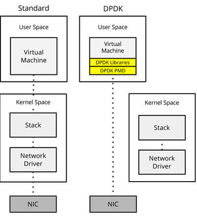

# DPDK (Data Plane Development Kit)

Traditionally, packet processing in a Linux system involves the NIC, the kernel, and finally the application processing the packets. This process can be inefficient and slow, especially at higher network speeds. The following represents a network packet at wire level. It contains information like the headers which help in routing the packet to the destination as well as the payload intended for the application. The headers contain information like the MAC address of the NIC to which this packet is intended.

<table style="border-collapse: collapse;">
  <tr>
    <td style="border: 4px solid black; padding: 10px;">Ethernet Header</td>
    <td style="border: 4px solid black; padding: 10px;">IP Header</td>
    <td style="border: 4px solid black; padding: 10px;">TCP Header</td>
    <td style="border: 4px solid black; padding: 10px;">Data</td>
  </tr>
</table>

The packet arrives at the NIC. NIC copies the packet into packet buffer pool in the main memory (RAM) using DMA. NIC generates an interrupt to notify the CPU. The NIC driver gets the packet data from the packet buffer pool. It allocates a Socket Buffer (SKB) to hold the packet data and pass it to the Linux protocol stack. It is determined by the kernel whether the packet is intended for local delivery or forwarding. Packet is transferred to the TCP stack and finally it is passed on to the application via the socket read system call. Refer to [Linux Networking Guide](Linux_Networking.md) for more details.

As you can see, there are a whole lot of procedures to get the packet to the application layer. Natural question coming to our mind will be – can this flow be optimized further? Precisely this optimization is done by a framework called DPDK. DPDK stands for Data Plane Development Kit. It is a set of libraries and drivers for high-performance packet processing in the user space. You can convert a general-purpose processor into your own packet forwarder without having to use expensive custom switches and routers. DPDK was originally developed by Intel to run on x86 based CPUs, and now supports other CPU types, such as ARM and IBM POWER9. DPDK runs mostly on Linux-based distributions. It also supports FreeBSD for certain features.

DPDK uses `Fast Path` to bypasses the kernel networking stack to provide faster packet processing. A fast path is created from the NIC to the application within user space, in turn, bypassing the kernel. This eliminates space switching when moving the frame between user space and kernel space. Additionally, further gains are also obtained by negating the kernel stack and network driver, and the performance penalties they introduce.

DPDK uses `Poll Mode Drivers` (PMDs) to achieve high packet processing rates by avoiding interrupt overhead. Instead of the NIC raising an interrupt to the CPU when a frame is received, the CPU runs a poll mode driver or PMD in short to constantly poll the NIC for new packets. However, this does mean that a CPU core must be dedicated and assigned to running PMD.

The DPDK can receive and send packets within the minimum number of CPU cycles (usually less than 80 cycles). It is suitable for environments where maximum performance and efficiency are critical. It is commonly used in network appliances like firewalls, load balancers, and routers that require high throughput and low latency.

When DPDK takes control of a NIC, it removes that interface from the standard kernel networking stack. Once a NIC is bound to a DPDK-compatible driver (like `vfio-pci` or `igb_uio`), the kernel no longer manages it, making it invisible to standard networking tools. Tools like `ip` and `ifconfig` rely on the kernel's networking stack to report interface statuses. Since the DPDK-bound NICs are no longer under the kernel's control, these tools cannot detect or interact with them. Other network management tools and utilities that depend on kernel networking functions will also be unable to see or manage these interfaces.

## DPDK Open Source Projects

DPDK is widely used in various fields that require high-performance packet processing. You can find a list of open source projects consuming DPDK in [here](https://www.dpdk.org/ecosystem/). Some of these notable projects are:

### Butterfly – Connects Virtual Machines

Butterfly is a daemon that connects virtual machines and manages their traffic flow. It leverages DPDK to achieve high performance in networking by using a dedicated network interface card to send and receive VXLAN packets. Butterfly facilitates the creation and management of virtual NICs (vnics) and security groups, allowing for network isolation and firewalling per VM based on security groups. This project enables efficient VM-to-VM communication with minimal CPU usage, making it suitable for cloud environments and VM orchestration. More information [here](https://github.com/outscale/butterfly).

### TRex – Stateful Traffic Generator

TRex is an open-source, high-performance stateful and stateless traffic generator fueled by DPDK. It can emulate various network traffic scenarios for performance testing and benchmarking of network devices and functions. TRex supports complex traffic patterns, allowing users to test and validate network behavior under different conditions. It is widely used for testing network equipment and validating the performance of network infrastructures. More information [here](https://github.com/cisco-system-traffic-generator/trex-core).

### VPP (Vector Packet Processing)

VPP is a high-performance, packet-processing software platform developed under the Fast Data Project (FD.io). It uses vector processing techniques to optimize packet throughput and reduce latency. It is designed to be highly scalable and is capable of running on a wide range of hardware, from low-end devices to high-end servers. It leverages DPDK for efficient packet I/O, making it suitable for various network functions and services, including routers, firewalls, and load balancers. More information [here](https://s3-docs.fd.io/vpp/25.06/#).

### Open vSwitch – Multilayer Open Virtual Switch

Open vSwitch (OVS) is an open-source, multilayer virtual switch that provides advanced network features such as network automation, monitoring, and performance optimization. By integrating DPDK, OVS enhances its packet processing capabilities, enabling high-speed data transfer and reduced latency. This makes OVS suitable for use in data centers, cloud environments, and Network Functions Virtualization (NFV) scenarios, where efficient network management and performance are critical.

The following figure shows the standard OVS vs OVS-DPDK. Out of the box, OVS implements a kernel based data path, along with a user space daemon (`ovs-vswitchd`). This daemon processes new flows, allowing northbound controllers to programmatically update the control plane. However, even though the frame is cached within the kernel, it must be moved to user space for processing by the virtual function. Context switching the frame between address spaces is expensive with regards to CPU cycles.

OVS introduced DPDK support in OVS 2.2. OVS-DPDK moves the OVS kernel data path into the user space. Frames are then retrieved directly from the NIC using a poll mode driver, allowing us to bypass the kernel. With the frame and the VNF both now within user space, further techniques can be used to move the frame between OVS and the VNF, such as vHost User.

vHost User is a communication protocol that allows the high-performance interaction between user space processes, such as virtual machine instances, and the kernel-based virtual machine (KVM) hypervisor. It is primarily used to accelerate network I/O for virtual machines by enabling direct communication between the VM's virtual NIC (vNIC) and the hypervisor's backend. vHost User is often used with DPDK to provide fast packet processing capabilities within VMs. DPDK's poll-mode drivers can directly communicate with the hypervisor, further reducing overhead.

vHost User is introduced within OVS 2.4.0. It allows QEMU to share the memory location of the guests' virtual queues with DPDK. QEMU shares the memory allocations via the drivers' backend implementations within OVS-DPDK. This allows OVS-DPDK to send and receive frames between the queues via DMA, resulting in a huge performance benefit.
