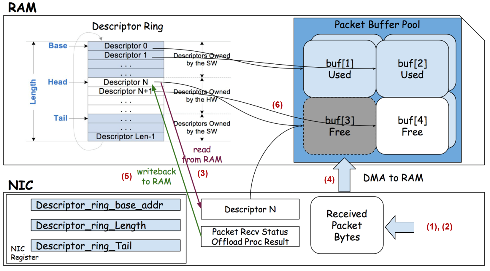
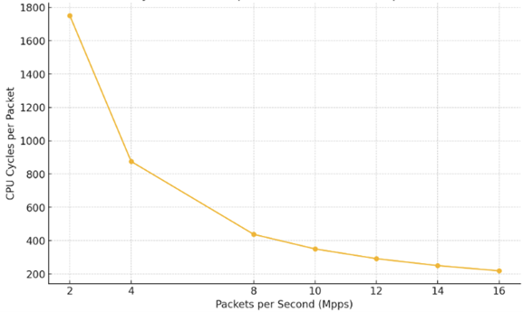

# Linux Networking

## Network Interface Controller (NIC)

A Network Interface Controller (NIC) is a hardware component that connects a host to a network either by using cables or wirelessly. It can be an internal or external device that provides the interface between the computer and the network. There exists different types of NICs such as Ethernet NICs, Wireless NICs, and Fiber. Ethernet NICs are the most common types of NICs used in wired networks. They connect devices using Ethernet cables.

A NIC is connected to a host computer in several ways, depending on the type of NIC and the host's design. PCI (Peripheral Component Interconnect) is the older interface used for connecting NICs. Modern NICs use PCI Express (PCIe in short) that provides faster data transfer rates. Majority of motherboards come with integrated NICs, meaning the NIC is built directly onto the motherboard. There exists USB NICs as well that are connected via a USB port and are plug-and-play.

## Device Driver

A `device driver`, or driver in short, is a specialized software program that allows the operating system to communicate with hardware devices. It acts as a translator between the hardware and the software applications that use the device. Drivers abstract the hardware details from the OS and applications, providing a standard interface for communication. They ensure that hardware devices work correctly with various software and OS versions.

All Ethernet NIC require a device driver to interface with the operating system. Many cards can work with Windows, Linux, and Macintosh, requiring a different driver for each operating system. The drivers for many manufacturers’ cards may already be included in the operating system, but often newer cards require or can benefit from an updated driver installation. Most vendors will provide a CD disk with an automated driver installation wizard; however, some may require that the driver be installed manually in the operating system.

## Firmware

`Firmware` is a low-level software that is embedded into hardware devices. It provides the necessary instructions for the hardware to communicate with other hardware and software systems. Firmware resides in non-volatile memory, such as ROM, EEPROM, or flash memory, meaning it retains its settings even when the device is powered off. Vendors regularly release new firmware for their devices to fix bugs, improve the performance, add new features or protect the device from security vulnerabilities. Some products can regularly check for new firmware and download it, or you can check for new firmware and download it manually.

## Packet Buffer Pool

The packet buffer pool is a region of memory allocated by the NIC driver to store packet data. It consists of multiple buffers, each capable of holding a network packet. The NIC driver typically allocates these buffers during initialization and manages them throughout the lifetime of the network interface. The size of the packet buffer pool in a Linux system is not fixed and can vary depending on several factors, including the NIC driver, the system configuration, and the specific network workload.

High-performance or high-throughput network environments may require larger buffer pools to handle bursts of traffic and to avoid packet drops. The total amount of available system memory will influence how many buffers can be allocated. Systems with more RAM can support larger buffer pools. The kernel and NIC driver must ensure that allocating too many buffers does not exhaust system resources, which could impact overall system performance.

In many network driver implementations, there are separate packet buffer pools for `receive` (RX) and `transmit` (TX) traffic. This separation helps manage the distinct requirements and workflows of handling incoming and outgoing packets efficiently. RX buffer pool stores incoming packets received from the network before they are processed by the system. Similarly, TX buffer pool stores outgoing packets that are to be transmitted to the network.

Separate pools allow for specialized handling and optimization of RX and TX traffic. For instance, receive buffers can be optimized for fast write operations by the NIC, while transmit buffers can be optimized for fast read operations. The NIC and driver can handle incoming and outgoing traffic independently, reducing contention and improving performance. Finally, memory allocation and deallocation can be tailored for the different characteristics of RX and TX traffic. For example, RX buffers might be continuously reused for incoming traffic, while TX buffers might be allocated and freed more dynamically based on the outgoing traffic load.

## Packet Descriptors

A packet descriptor is a data structure used by network interface cards to manage packet processing. As the name suggests, a descriptor describes a packet. It does not contain the packet data itself. Instead, it provides metadata about the packet and a reference (usually a pointer) to a memory buffer that holds the actual packet contents. The structure of a packet descriptor can vary depending on the specific hardware and driver implementation. Each descriptor typically includes information such as:

- The DMA address of the packet buffer, enabling direct memory access by the NIC.
- The length of the packet.
- The status, indicating the ownership (hardware or software) and any error flags.
- Various control flags, such as indicators for the start or end of a packet.
- A pointer to the next descriptor, supporting ring or linked list configurations.

Below is a hypothetical C structure representing a packet descriptor:

```text
struct packet_descriptor {
    dma_addr_t buffer_addr;         // Physical address of the packet buffer (DMA address)
    uint16_t length;                // Length of the packet data
    uint16_t status;                // Status of the descriptor (e.g., owned by HW/SW, errors)
    uint16_t control_flags;         // Control flags (e.g., end-of-packet, start-of-packet)
    struct packet_descriptor *next; // Pointer to the next descriptor in the ring buffer
};
```

## Ring Buffer

A ring buffer is a fixed-size circular array of packet descriptors used for efficient packet transmission and reception. During the initialization of a network interface, the NIC driver allocates the ring buffer in system memory (RAM), typically using kernel memory allocation functions such as `kmalloc` or `alloc_pages`.

To enable high-speed data transfer, the driver sets up Direct Memory Access (DMA), which allows the NIC to access system memory directly (bypassing the CPU) to read and write packet data. This significantly reduces processing overhead and improves throughput. The ring buffer is managed using three key pointers:

- **Base Pointer**: Points to the start of the ring buffer in memory. It is set during initialization and remains constant, serving as the fixed reference point for the descriptor array.

- **Head Pointer**: Managed by the NIC hardware, it indicates the next descriptor where a received packet will be stored (Rx path). As the NIC processes incoming packets, it increments this pointer.

- **Tail Pointer**: Managed by the NIC driver (software), it indicates the last buffer that has been prepared and made available to the NIC for future packet reception. Updating the tail informs the NIC that more space is available.

This coordinated movement of head and tail pointers allows efficient and continuous packet processing in a circular fashion, where descriptors are reused once they have been processed.

## Ring Buffer Size

The `ethtool` utility displays the ring buffer sizes for network interfaces.

```bash
ethtool -g eth0

Ring parameters for eth0:

Pre-set maximums:
RX:             4096
RX Mini:        2048
RX Jumbo:       4096
TX:             4096

Current hardware settings:
RX:             1024
RX Mini:        128
RX Jumbo:       512
TX:             512
```

Pre-set maximums indicate the maximum ring buffer sizes that the hardware can support for the various types of buffers. Note that we have three different ring buffers for RX. The size of incoming packets can vary widely, from very small control packets to large jumbo frames. Using different RX ring buffers for different packet sizes helps optimize memory usage and performance.

**Standard RX** ring buffer handles regular-sized packets, which are typically up to the standard Ethernet Maximum Transmission Unit (MTU) of 1500 bytes. This is the most commonly used ring buffer and is designed to store incoming packets that fit within the standard MTU.

**RX mini** ring buffer optimizes memory usage for small packets, which are much smaller than the standard MTU. This ring buffer is used for storing smaller packets, which are common in some types of network traffic, such as control messages and TCP acknowledgments. Using smaller buffers for these packets reduces wasted memory space and can improve performance by allowing more packets to be stored in cache-friendly sizes. Not all NICs or drivers implement RX mini buffers, but when they do, they can be beneficial for handling high volumes of small packets.

**RX jumbo** ring buffer handles jumbo frames, which are packets larger than the standard MTU (typically up to 9000 bytes). This ring buffer is used for storing jumbo frames, which are commonly used in high-performance networking environments to reduce overhead and improve efficiency. Allocating larger buffers for jumbo frames ensures that these large packets can be efficiently received and processed without fragmentation. Jumbo frames can improve network performance by reducing the number of packets needed to transmit large amounts of data, thus reducing overhead.

Also note that we have only one ring buffer for TX. The TX ring buffer handles outgoing packets that are to be transmitted onto the network. Since the driver and application control the packet sizes and manage the preparation of outgoing packets, a single TX ring buffer is typically sufficient. The TX ring buffer can handle packets of various sizes without needing separate buffers, as the driver can prepare packets of appropriate sizes before enqueueing them for transmission.

## Packet Reception Flow



1. **Packet Arrival on the Wire**:

    A network frame (e.g., Ethernet frame) arrives at the NIC via the physical network medium (e.g., Ethernet cable). The NIC detects the start of the frame using its hardware circuitry and begins capturing bits.

2. **Frame Reception and Parsing**:

    The NIC receives the entire frame, validates the Frame Check Sequence (FCS) (e.g., CRC check). If the frame is malformed or fails CRC, it may be dropped or marked as an error.

3. **Select a Free Descriptor in the Ring Buffer**:

    The NIC uses the head pointer to find the next available descriptor and its associated buffer (e.g. `buf[3]`) from the ring buffer in RAM.

4. **DMA Transfer to Packet Buffer**:

    The descriptor contains a DMA address pointing to a pre-allocated memory buffer. The NIC performs a DMA transfer, copying the received packet directly into that buffer in system RAM without CPU involvement. This transfer is done using the physical address previously provided by the driver.

5. **Descriptor Update by NIC**:

    After the DMA completes, the length field in the descriptor is updated with the size of the received packet. The status is updated to reflect successful reception (e.g., ownership flag changes from NIC to CPU, and flags like "End of Packet" or "Checksum OK" may be set).

6. **NIC Advances Head Pointer**:

    The NIC updates the head pointer to point to the next descriptor in the ring, preparing to receive the next packet.

7. **Notification to Host**:

    The NIC generates a hardware interrupt to notify the host that one or more packets have been received. In case of polling-based (NAPI in Linux) approach, the driver periodically checks the ring buffer in a more efficient way to reduce interrupt overhead at high packet rates.

8. **Driver Processes the Descriptor**:

    The NIC driver reads the updated descriptor and validates status/error flags. It then retrieves the buffer address and packet length. It may also perform additional tasks such as checksum validation, time-stamping, VLAN tagging, etc.

9. **Packet is Handed to the Kernel Network Stack**:

    The driver passes the packet up to the Linux kernel networking stack. It may wrap the packet in a `sk_buff` structure. This structure is then passed through protocol layers (Ethernet → IP → TCP/UDP).

10. **User-Space Delivery**:

    After protocol processing, the packet is ultimately delivered to the appropriate socket buffer of a user-space application, such as a web server, DNS resolver, or containerized service.

11. **Descriptor Recycled**:

    The driver marks the descriptor as "available". It sets the ownership back to the NIC. It also updates the tail pointer so the NIC knows it can reuse this buffer for future packets.

## Hardware Interrupts

To recall what we have learnt so far:

> When a packet arrives at the NIC, it is temporarily stored in the NIC's internal buffers. These buffers are small, fast memory areas on the NIC itself, designed to handle the high speed of incoming network traffic. The NIC uses a descriptor from the ring buffer to determine where to copy the incoming packet data. The NIC uses DMA to copy the packet data from its internal buffers to the memory buffer indicated by the descriptor in the ring buffer. DMA allows data to be transferred directly between the NIC and system memory without involving the CPU, which increases efficiency.

The packet data is now stored in one of the buffers in the packet buffer pool. The NIC updates the status of the descriptor in the ring buffer and generates a "hardware interrupt" to notify the CPU. This interrupt signals the CPU to take action on the newly received packet. The NIC driver, which is part of the operating system, has an interrupt handler that is triggered by the NIC's interrupt. This handler is a piece of code that executes in response to the interrupt. The interrupt handler processes the descriptors in the ring buffer, retrieves the packet data from the packet buffer pool, and performs any necessary actions to prepare the packet for further processing.

### Hardware Interrupt Moderation

Interrupt moderation reduces the frequency of interrupts by batching packet notifications. Instead of generating an interrupt for every packet, the NIC can accumulate several packets and then generate a single interrupt. This reduces the overhead associated with handling interrupts and allows the CPU to process multiple packets in a single batch. However note that with interrupt moderation, multiple packets might be processed together, leading to bursty traffic patterns in the capture. This can distort the perceived network behavior and complicate performance analysis.

The NIC driver allows the user to adjust the interrupt rates. Turning off interrupt moderation means every packet generates an interrupt which can lead to high CPU usage, but ensures the lowest possible latency. Setting the value to minimal means that the NIC generates interrupts at a minimal rate, aiming to reduce CPU usage as much as possible. This mode may increase latency slightly but is beneficial for reducing CPU load. Setting the value to adaptive means that the NIC driver adjusts the interrupt rate dynamically based on the network traffic load. When traffic is high, it reduces the number of interrupts to reduce CPU overhead. When traffic is low, it increases the interrupt rate to minimize latency.

## Socket Buffer (SKB)

In the Linux networking subsystem, the Socket Buffer, or `skb`, is a core data structure used to represent and manage packets as they traverse through the kernel’s networking stack. It contains “metadata” about the packet, such as its length, protocol, and pointers to the packet’s headers. This is crucial for the kernel to properly process and route the packet. The data buffer pointer in the SKB is set to point to the memory location where the packet data was stored by the NIC (from the packet buffer pool). You can find the definition of SKB in [here](https://github.com/torvalds/linux/blob/master/include/linux/skbuff.h).

Once the SKB is allocated and initialized, the NIC driver’s interrupt handler passes the SKB to the network stack. As the SKB moves up the network stack, each layer processes it according to its protocol (e.g., Ethernet at Layer 2, IP at Layer 3, TCP/UDP at Layer 4) in order to determine where that data is supposed to go: either to a remote system (that is, to be forwarded) or to a local socket that is interested in packets matching certain criteria (a combination of address and port). Each layer updates pointers within the SKB to reflect the parsing progress (e.g., `skb->data`, `skb->network_header`, `skb->transport_header`).

## Software Interrupts

After the NIC driver has handed off the SKB to the network stack, the processing required at each layer (such as routing decisions at the IP layer or checksum verification at the TCP layer) can be performed by "software interrupts". These interrupts, often implemented as `softirqs` or `tasklets` in the Linux kernel, are used to defer processing to a context outside of the interrupt handler, thereby improving system responsiveness and ensuring that high-priority tasks are not unduly delayed.

This mechanism helps maintain a balance between processing incoming packets promptly and ensuring that the CPU is not overwhelmed by interrupt handling duties. By using software interrupts, the network stack can perform necessary operations like protocol processing, packet forwarding, and delivering data to the appropriate sockets without stalling the entire system. Ultimately, this allows for smoother and more efficient handling of network traffic, ensuring that both high-priority and routine tasks are managed effectively within the kernel.

The long list of operations that happen between packet arrival and packet forwarding or application delivery includes ingress queuing, route lookups, firewall filters, routing rules, socket matching, header rewrite, encapsulation, error handling and much more. A lot of CPU time is spent just figuring out what to do with a single packet. One major challenge is how to maintain high-speed packet processing with ever increasing line speed to hundreds of Gbps or Tbps. Let us go over an example to demonstrate this.

### Network Packet Processing and CPU Time

Consider connecting a 100 Gbps Ethernet NIC to a personal computer. We need to ensure that the motherboard has the appropriate PCIe slots. A 100 Gbps NIC typically requires a PCIe 3.0 or 4.0 slot with x16 lanes to accommodate the high bandwidth. NVIDIA Mellanox Ethernet NIC is a 100 Gbps card with dual-port QSFP28 optical ports using PCIe 3.0 x 16. You can shop for these NICs in [here](https://www.fs.com/c/network-adapters-4253?345=30583,52926&406=38904).

To find the number of packets per second (PPS) that can be handled by the NIC, we need to make some assumptions about the packet size. Let's assume the average packet size is 1518 bytes (including Ethernet headers). Thus PPS will be:

$$
\text{PPS} = \frac{100 \times 10^9 \ \text{bits/sec}}{1518 \times 8 \ \text{bits/packet}} = 8{,}233{,}587 \ \text{packets/sec} \approx 8.2 \ \text{Mpps}
$$

Let us assume the CPU is single core with speed of 3.5 GHz which is equal to 3.5 billion cycles per second. To handle the 8.2 Mpps traffic load, the processing of each packet must be completed within 425 CPU cycles. If the packet processing takes longer than this, the system will not be able to keep up with the incoming traffic, leading to potential packet loss or performance degradation. As PPS increases, each packet gets a smaller slice of the fixed number of cycles available per second, thus reducing the number of cycles available per packet. This inverse relationship is why CPU cycles per packet decrease as the PPS increase. The following figure shows the trend.



## Instructions Per Clock (IPC)

Instructions Per Clock (IPC) is a measure of a processor's efficiency in executing instructions. Specifically, IPC indicates the average number of instructions a CPU can execute per clock cycle. The higher the IPC, the more efficient the CPU is at processing instructions. Older or simpler CPU designs might have an IPC close to 1. This means, on average, they execute approximately one instruction per cycle. Modern high-performance CPUs have IPC values greater than 1. For example, a modern Intel or AMD processor might achieve an IPC of 4 under optimal conditions.

| CPU Microarchitecture           | Approx IPC (Single Thread)  | Notes                                             |
|---------------------------------|-----------------------------|---------------------------------------------------|
| Intel Skylake (6th Gen)         | ~4.0                        | Wide out-of-order, good speculative execution     |
| Intel Alder Lake / Raptor Lake  | ~4.5–5.0+                   | Performance cores (P-cores), big jump             |
| AMD Zen 2                       | ~4.0                        | Efficient and balanced design                     |
| AMD Zen 3                       | ~4.5                        | Big uplift over Zen 2                             |
| Apple M1/M2/M3                  | ~6.0+                       | Very high IPC, especially in single-thread tasks  |

Modern NICs can receive millions of packets per second (e.g., 10 Gbps ≈ 8.2 Mpps for 1518B frames). For each received packet, the Linux kernel or user-space network stack must handle interrupts or poll descriptors, copy or inspect data, run protocol logic (L2, L3, L4), and update statistics or flow tables. When packet arrival rate exceeds the rate at which the CPU can handle them, the NIC's ring buffer overflows, leading to packet drops. High IPC allows the system to drain the ring buffer faster, reducing drop risk under heavy load.

Frameworks like DPDK, XDP, and eBPF rely on raw CPU performance. They often bypass parts of the kernel for performance and operate in tight loops. A CPU with higher IPC can run packet processing pipelines (parsing, matching, actions) faster and with lower power.

## NIC Hardware Offloading

NIC offloading refers to the technique of moving certain network-related tasks and operations from the CPU to the NIC itself. Offloading tasks to the NIC can reduce the burden on the CPU, allowing it to perform other tasks more efficiently. By handling certain tasks directly on the NIC, network latency can be reduced and throughput can be increased.

**Checksum Offloading**

One notable example of NIC offloading is IP/UDP/TCP checksum offloading. Checksum offloading is a feature where the NIC handles the calculation and verification of checksums for network packets. Here is an explanation.

- Transmission:

    The CPU creates a network packet and leaves the checksum field blank or sets it to zero. The CPU includes an instruction in the packet descriptor (a metadata structure used to describe the packet) indicating that the NIC should calculate and insert the checksum. When the packet reaches the NIC, the NIC calculates the appropriate checksum for the packet. It inserts the calculated checksum into the appropriate field in the packet, and then transmits the packet over the network with the correct checksum.

- Reception:

    The NIC receives an incoming packet from the network. It calculates the checksum for the incoming packet and compares it to the checksum included in the packet. If the calculated checksum matches the checksum in the packet, then the packet is considered valid. If it does not match, the packet is marked as corrupted. The NIC passes the packet to the CPU along with metadata that includes the result of the checksum verification (valid or invalid).

**ARP Offloading**

ARP offloading is a feature that allows the NIC to handle Address Resolution Protocol (ARP) requests and responses without involving the host CPU. The same feature for IPv6 is NS offload. This offloading can improve network performance and reduce power consumption, particularly in scenarios where network traffic is high or where power efficiency is crucial, such as in battery-powered devices.

When a network device is initialized, the CPU handles the initial ARP traffic to learn the network's devices' MAC addresses. It populates the ARP cache with these mappings. The NIC is configured with the device's IP address and MAC address, enabling it to respond to ARP requests for its IP address. The NIC maintains its own ARP cache, storing IP-to-MAC address mappings. When an ARP request is received by the NIC, it checks if the requested IP address matches its own or any stored in its ARP cache. If the requested IP address matches, the NIC generates and sends an ARP response directly without involving the CPU. If there is no match, the NIC can either ignore the request or forward it to the CPU for further processing, depending on the configuration. When the NIC receives an ARP response, it can update its ARP cache accordingly, again without involving the CPU.

**Large Send Offload version 2**

Large Send Offload version 2 (LSOv2) is an enhanced version of the Large Send Offload (LSO) feature. It allows the NIC to handle the segmentation of large TCP packets into smaller ones that fit within the Maximum Transmission Unit (MTU) size of the network, thereby offloading this task from the CPU. This can significantly improve the efficiency of data transmission, especially in high-throughput environments. LSOv2 supports a wider range of protocols and scenarios compared to LSO. While LSO primarily focuses on TCP segmentation, LSOv2 extends support to more advanced use cases. Furthermore, LSOv2 offers better performance and efficiency improvements over the original LSO, particularly in high-throughput environments.

**Show List of Offloading**

You can use the following command to display the current offloading settings of a specified network interface.

```bash
ethtool --show-offload enp0s3
```

Although NIC offloading feature provides many benefits, it can add complexity to the network and system configuration. Not all NICs and network environments support all types of offloading, which can lead to compatibility issues. Besides NIC offloading can introduce several issues when capturing network traffic using Wireshark or similar packet capture tools. This is because offloading changes the way packets are processed and appear on the network, which can lead to discrepancies between what Wireshark captures and the actual traffic being transmitted or received. Here are some of the key problems:

When checksum offloading is enabled, the NIC handles the checksum calculation and validation. Thus, captured packets might show incorrect or missing checksums, leading to confusion in packet analysis. In Wireshark these show up as outgoing packets marked black with red Text and the note [_incorrect, should be xxxx (maybe caused by "TCP checksum offload"?_)]. Installations of Wireshark 1.2 and above disable IP, TCP, and UDP checksum validation by default.
