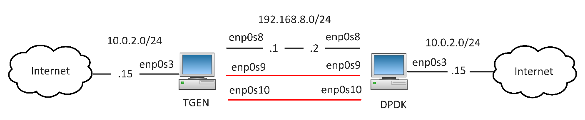

# DPDK-LabNet

dpdk-labnet is a virtualized network lab environment designed to facilitate experimentation and testing with the Data Plane Development Kit (DPDK). The primary objective is to create a minimal yet functional setup consisting of two virtual machines, each configured with DPDK support, connected through a virtual network. This environment allows for the simulation and evaluation of high-performance packet processing, zero-copy buffer management, and inter-VM traffic generation using DPDK-based applications. The lab provides a controlled platform to explore features such as poll-mode drivers (PMDs), memory pools, flow classification, and custom packet forwarding pipelines, making it ideal for learning, development, and performance benchmarking of DPDK in a reproducible setup.

The following guides provide an introduction to Linux networking and DPDK:

- [Linux Networking](Linux_Networking.md)
- [DPDK Introduction](DPDK.md)

## DPDK Test Setup

We are going to create two Ubuntu 20.04 VMs as shown below:



Interface `enp0s3` on both hosts is primarily for connecting the VM to the Internet. It is essential for downloading and installing necessary packages, updates, and dependencies directly from the Internet. This keeps the VM updated and ensures you have access to the latest software and security patches. The network mode of interface `enp0s3` is set to NAT so that each VM can communicate with the outside world.

The network mode of interface `enp0s8`, `enp0s9`, and `enp0s10` are set to "Internal Network" that allows direct interaction between the two VMs. The internal network is completely isolated from the host and external networks, which is beneficial for controlled testing environments where you want to eliminate external factors. It enables direct communication between VMs without involving the host's networking stack, reducing latency and overhead.

On DPDK VM, interface `enp0s9` and `enp0s10` are assigned to DPDK stack. When these interfaces are bound to DPDK, they are no longer managed by the kernel and therefore not accessible for standard network operations. We need interface `enp0s8` to be able to SSH to the remote DPDK host.

## Create Ubuntu DPDK VM

Create an Ubuntu 20.04 VM in virtual box, and name it dpdk. You can download an image from [here](https://releases.ubuntu.com/focal/ubuntu-20.04.6-desktop-amd64.iso). Once the VM is created, install these packages:

```bash
sudo apt update
sudo apt upgrade
```

```bash
export DEBIAN_FRONTEND=noninteractive

sudo apt install -y \
    build-essential \
    libnuma-dev \
    python3 \
    python3-pip \
    python3-pyelftools \
    python-pyelftools \
    meson \
    ninja-build \
    pkg-config \
    libpcap-dev \
    git \
    net-tools \
    iputils-ping \
    pciutils \
    kmod \
    iproute2 \
    wireshark-qt \
    scapy \
    wget
```

Clone the dpdk git repository on the desktop:

```bash
git clone https://github.com/DPDK/dpdk.git
```

And then install it:

```bash
cd dpdk
meson build
ninja -C build
ninja -C build install
sudo ldconfig
```

Assign static IP address to interface `enp0s8`:

```bash
sudo ifconfig enp0s8 192.168.8.2 netmask 255.255.255.0
```

**Binding Interface to DPDK**

On the DPDK VM, go to the DPDK repository, and check the CPU configurations:

```bash
cd ~/Desktop/dpdk/usertools/
./cpu_layout.py
```

You should see something like:

```bash
cores =  [0, 1, 2, 3, 4, 5, 6, 7, 8, 9]
sockets =  [0]

       Socket 0
       --------
Core 0 [0]
Core 1 [1]
Core 2 [2]
Core 3 [3]
Core 4 [4]
Core 5 [5]
Core 6 [6]
Core 7 [7]
Core 8 [8]
Core 9 [9]
```

Check the NIC binding status:

```bash
./dpdk-devbind.py --status

Network devices using kernel driver
===================================
0000:00:03.0 '82540EM Gigabit Ethernet Controller 100e' if=enp0s3 drv=e1000 unused=vfio-pci *Active*

0000:00:08.0 '82540EM Gigabit Ethernet Controller 100e' if=enp0s8 drv=e1000 unused=vfio-pci *Active*

0000:00:09.0 '82540EM Gigabit Ethernet Controller 100e' if=enp0s9 drv=e1000 unused=vfio-pci

0000:00:0a.0 '82540EM Gigabit Ethernet Controller 100e' if=enp0s10 drv=e1000 unused=vfio-pci
```

This tells us that all four virtual adapters are currently using a kernel driver. Let us focus on the first network device at PCI address `0000:00:03.0`. The `if=` indicates the network interface name associated with the device, which in this case, `enp0s3` is the name of the network interface. The `drv=` shows the kernel driver currently in use by the network device. The `e1000` driver is a common driver for Intel Ethernet controllers. The `unused=` indicates that the `vfio-pci` driver is available but not currently being used by this device.

The first two network devices are marked as "Active" which means that they are up and running and they are actively participating in network communication. We are going to bind the other two interfaces to DPDK that are not active at the moment. If they are active, then change them to down.

```bash
sudo ifconfig enp0s9 down
sudo ifconfig enp0s10 down
```

Load `uio_pci_generic` kernel module:

```bash
sudo modprobe uio_pci_generic
```

Check the interface binding status one more time.

```bash
./dpdk-devbind.py --status
```

Note that the interface is not active any more.

```bash
Network devices using kernel driver
===================================
<snip>
0000:00:09.0 '82540EM Gigabit Ethernet Controller 100e' if=enp0s9 drv=e1000 unused=vfio-pci,uio_pci_generic

0000:00:0a.0 '82540EM Gigabit Ethernet Controller 100e' if=enp0s10 drv=e1000 unused=vfio-pci,uio_pci_generic
<snip>
```

Also note that `vfio-pci` and `uio_pci_generic` kernel modules are available.

- `vfio-pci` is a driver that is part of the VFIO (Virtual Function I/O) framework in the Linux kernel. It provides secure access to PCI devices for user space applications. This is particularly useful in virtualization scenarios, such as with KVM/QEMU, where a physical PCI device (like a GPU or network card) needs to be directly assigned to a virtual machine.

- `uio_pci_generic` is a generic driver for PCI devices that utilizes the UIO (Userspace I/O) framework. It provides a simple and efficient mechanism for user space applications to directly access PCI hardware without the need for a custom kernel driver. This is particularly useful for applications requiring low-latency access to hardware, such as those using the DPDK.

Bind both network devices above to `uio_pci_generic`:

```bash
sudo ./dpdk-devbind.py --bind=uio_pci_generic 0000:00:09.0
sudo ./dpdk-devbind.py --bind=uio_pci_generic 0000:00:0a.0
```

Check the interface binding status.

```bash
./dpdk-devbind.py --status
```

Note that both network devices are now bounded to DPDK.

```bash
Network devices using DPDK-compatible driver
============================================
0000:00:09.0 '82540EM Gigabit Ethernet Controller 100e' drv=uio_pci_generic unused=e1000,vfio-pci

0000:00:0a.0 '82540EM Gigabit Ethernet Controller 100e' drv=uio_pci_generic unused=e1000,vfio-pci

Network devices using kernel driver
===================================
0000:00:03.0 '82540EM Gigabit Ethernet Controller 100e' if=enp0s3 drv=e1000 unused=vfio-pci,uio_pci_generic *Active*

0000:00:08.0 '82540EM Gigabit Ethernet Controller 100e' if=enp0s8 drv=e1000 unused=vfio-pci,uio_pci_generic *Active*
```

**Enable Hugepages**

DPDK makes heavy use of hugepages. Hugepages are a memory management feature used in modern operating systems to improve the efficiency of memory access and reduce the overhead associated with managing large amounts of memory. They allow the operating system to allocate memory in larger chunks (pages) than the default size, which is typically 4 KB on many systems.

With larger page size, fewer pages are needed to cover the same amount of memory. This results in smaller page tables, which reduces the memory overhead and the time spent managing these tables. Moreover, hugepages eliminate pressure on the `Translation Lookaside Buffer` (TLB). TLB is a cache used by the CPU to speed up virtual-to-physical address translation. Using hugepages means fewer entries are needed in the TLB, which can reduce TLB misses and improve performance.

In the DPDK VM, check to see if hugepages are currently enabled on your system.

```bash
grep -i huge /proc/meminfo

AnonHugePages:         0 kB
ShmemHugePages:        0 kB
FileHugePages:         0 kB
HugePages_Total:       0
HugePages_Free:        0
HugePages_Rsvd:        0
HugePages_Surp:        0
Hugepagesize:       2048 kB
Hugetlb:               0 kB
```

If not enabled, then allocate 2048 hugepages of 2 MB each by:

```bash
su -
echo 2048 > /sys/kernel/mm/hugepages/hugepages-2048kB/nr_hugepages
```

Ensure the hugepages filesystem is mounted:

```bash
sudo mkdir /mnt/huge
sudo mount -t hugetlbfs nodev /mnt/huge
```

Verify that hugepages are properly allocated:

```bash
grep -i huge /proc/meminfo

AnonHugePages:         0 kB
ShmemHugePages:        0 kB
FileHugePages:         0 kB
HugePages_Total:     237
HugePages_Free:      237
HugePages_Rsvd:        0
HugePages_Surp:        0
Hugepagesize:       2048 kB
Hugetlb:          485376 kB
```

**DPDK Hello World Example**

In the DPDK VM, go to DPDK hello_world example folder, and build it:

```bash
cd ~/Desktop/dpdk/examples/helloworld
make
```

And then invoke it like the following:

```bash
sudo ./build/helloworld -l 0-1 -n 2

EAL: Detected CPU lcores: 10
EAL: Detected NUMA nodes: 1
EAL: Detected shared linkage of DPDK
EAL: Multi-process socket /var/run/dpdk/rte/mp_socket
EAL: Selected IOVA mode 'PA'
EAL: VFIO support initialized
EAL: Probe PCI driver: net_e1000_em (8086:100e) device: 0000:00:09.0 (socket -1)
EAL: Probe PCI driver: net_e1000_em (8086:100e) device: 0000:00:0a.0 (socket -1)
TELEMETRY: No legacy callbacks, legacy socket not created
hello from core 0
hello from core 1
```

The `-l 0-1` option specifies the list of logical cores (lcores) on which the application will run. In here, `0-1` means the application will run on logical cores 0 and 1. The `-n 2` option specifies the number of memory channels per socket that the application should use.

By specifying `-l 0-1`, you are instructing the DPDK Environment Abstraction Layer (EAL) to bind the application's processing threads to CPU cores 0 and 1. This means that the application will run on these specific cores, ensuring that the threads do not get scheduled on other cores by the operating system. This is referred to as `core affinity` and helps in reducing context switches and cache misses, leading to better performance.

## Create Ubuntu TGEN VM

To create the TGEN VM, we can clone the previously created VM. Shutdown the first VM, right click on it, and select clone. Set the name to TGEN, select MAC address policy to generate new MAC addresses for all network adapters and select Next. In the next windows, select “Full clone” and hit clone.

Assign static IP address to interface `enp0s8`:

```bash
sudo ifconfig enp0s8 192.168.8.1 netmask 255.255.255.0
```

Ping DPDK VM to make sure that it is reachable.

```bash
ping 192.168.8.2
```

`enp0s9` and `enp0s10` interfaces are connected to the remote DPDK host VM. Make sure these ports are up:

```bash
sudo ifconfig enp0s9 up
sudo ifconfig enp0s10 up
```

## Traffic Generation

To validate packet processing functionality, traffic is transmitted from the TGEN VM to the DPDK VM via the `enp0s9` interface. The DPDK VM receives the packets, performs MAC address swapping, and forwards the modified packets back to the TGEN VM using the `enp0s10` interface. This looped flow provides a controlled mechanism to verify DPDK-based packet reception, processing, and transmission between virtual machines.

**Start DPDK L2 Forwarding**

The `l2fwd` (Layer 2 Forwarding) example in DPDK is a sample application that demonstrates simple packet forwarding. It works at the data link layer (Layer 2) of the OSI model and performs basic MAC address swapping. The primary function of l2fwd is to receive packets on one network interface, process them (typically by swapping MAC addresses), and then transmit them out of another network interface.

In the DPDK VM, go to DPDK l2fwd example folder, and build it:

```bash
cd ~/Desktop/dpdk/examples/l2fwd
make
```

Start L2 forwarding by:

```bash
sudo ./build/l2fwd -l 0-1 -n 2 -- -q 1 -p 0x3
```

Note that the double hash is used to separate the options for the l2fwd application from the options that are passed to the DPDK EAL. Everything before `--` is passed to the EAL, and everything after `--` is passed to the l2fwd application itself.

The `-p 0x3` option specifies the port mask, which determines which ports the application will use. In this case, 0x3 means port 0 and 1 (binary 0011) where each bit represents a port. In DPDK, a queue pair consists of a receive (RX) queue and a transmit (TX) queue. The `-q 1` option specifies the number of queue pairs per port.

**Send Traffic from TGEN VM**

Go to the TGEN VM, and start Wireshark to monitor return traffic traffic on the `enp0s10` interface.

```bash
sudo wireshark &
```

Invoke the traffic.py Scapy script to send traffic on `enp0s9` interface:

```bash
sudo python3 traffic.py
```

The l2fwd application on DPDK VM receives the packet and forward it back. The output of the l2fwd program shows this clearly.

```bash
Port statistics ====================================
Statistics for port 0 ------------------------------
Packets sent:                        0
Packets received:                    5
Packets dropped:                     0
Statistics for port 1 ------------------------------
Packets sent:                        5
Packets received:                    0
Packets dropped:                     0
Aggregate statistics ===============================
Total packets sent:                  5
Total packets received:              5
Total packets dropped:               0
====================================================
```

You should also be able to see the received packet in the Wireshark.

**DPDK Test Packet Management**

DPDK provides `testpmd` utility for testing and benchmarking packet processing capabilities. It stands for "Test Packet Management Daemon", and allows users to send, receive, and manipulate packets to test the performance and functionality of DPDK-enabled network interfaces and applications.

TODO